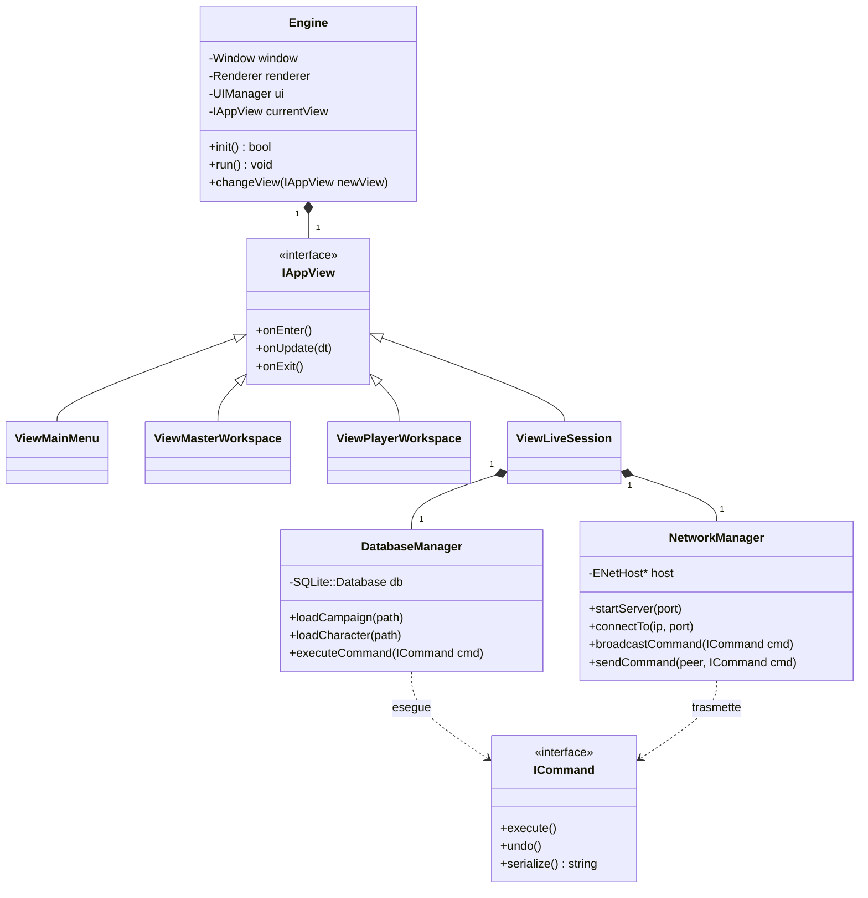

# Architettura del Software e Class Diagram

Il software utilizza un'architettura modulare. La UI è staccata dai Dati, che a loro volta sono staccati dalla Rete. La comunicazione avviene tramite il **Command Pattern**.

## Diagramma delle Classi Principali



## Macchina a Viewi (Ciclo di Vita dell'App)

```mermaid
ViewDiagram-v2
    [*] --> InitEngine
    InitEngine --> ViewMainMenu : SDL/ImGui Pronti

    ViewMainMenu --> ViewMasterWorkspace : Crea/Carica Campagna (Offline)
    ViewMainMenu --> ViewPlayerWorkspace : Modifica PG (Offline)
    ViewMainMenu --> ViewLiveSession : Host / Join

    ViewMasterWorkspace --> ViewMainMenu : Salva & Esci
    ViewPlayerWorkspace --> ViewMainMenu : Salva & Esci
    
    View ViewLiveSession {
        [*] --> Handshake
        Handshake --> SyncMappa E Roster
        SyncMappa E Roster --> InGioco
        InGioco --> SincronizzazioneComandi
    }

    ViewLiveSession --> ViewMainMenu : Disconnessione
```