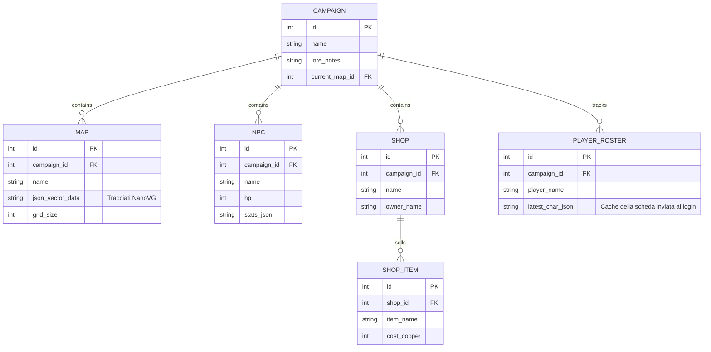
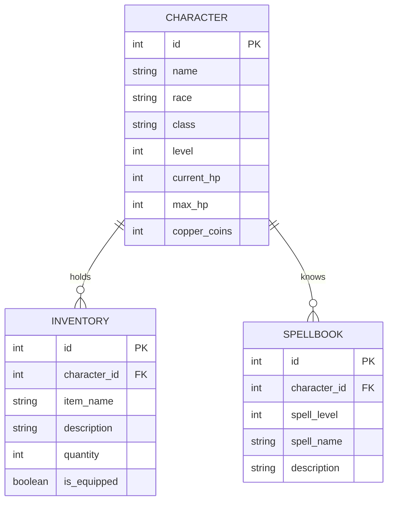

# Schema del Database (Entity-Relationship Diagram)

L'applicazione utilizza SQLiteCpp per gestire i dati. 
La separazione fisica dei file (`.dndcamp` per il Master, `.dndchar` per il Player) garantisce la portabilità e la modalità offline.

## Database Campagna del Master (`.dndcamp`)

## Database Personaggio del Player (`.dndchar`)

