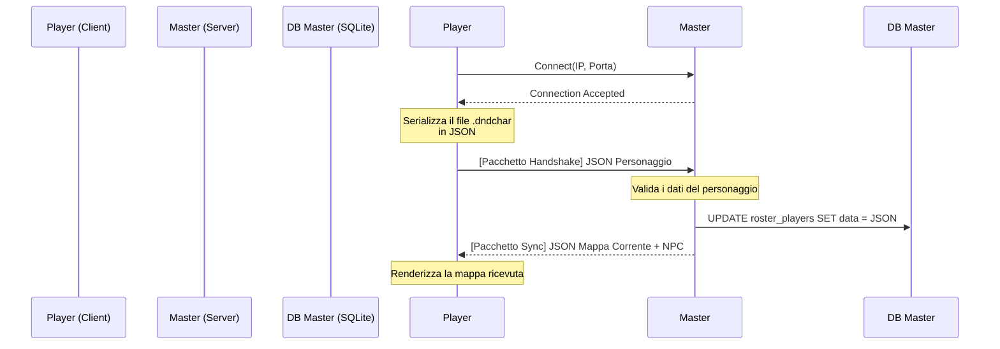
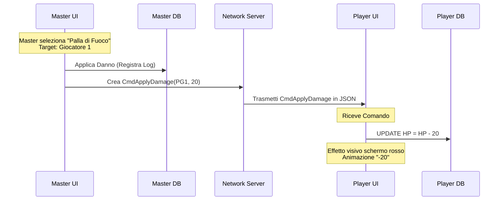
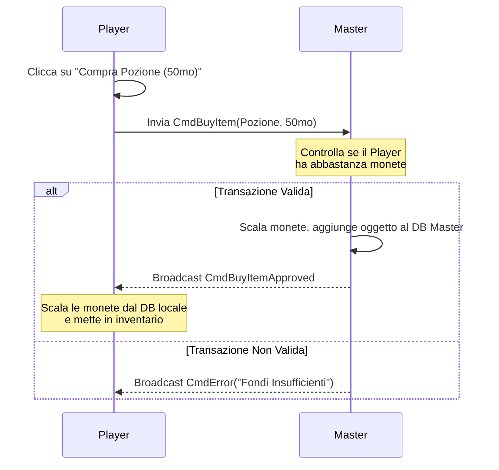

# Protocolli di Rete e Diagrammi di Sequenza

L'architettura di rete è **Server-Authoritative**. I client non modificano mai lo Stato globale del gioco direttamente, ma inviano richieste sotto forma di *Comandi JSON* che il Master valida.

## 1. Flowchart / BPMN: L'Handshake di Connessione
Quando un Player si connette, deve inviare la sua scheda personaggio aggiornata (livellata offline).

## 2. BPMN / Flowchart: Combattimento (Il Master infligge danno)
Flusso logico di quando un Master compie un'azione diretta su un giocatore.

## 3. Flusso di un'azione del Player (Es. Acquisto allo Shop)
Il Player tenta un'azione. Il Master deve validarla prima che diventi effettiva per tutti.

